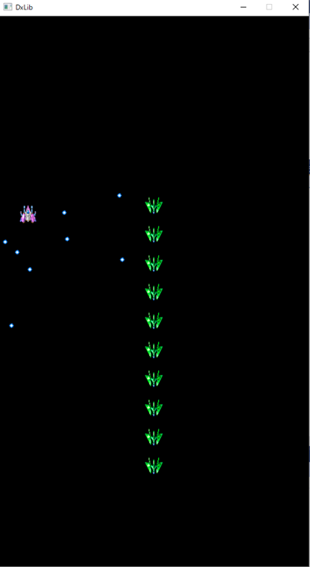

# シューティングゲーム向けゲームエンジン

# 経過画像
 

# 課題
## 自分なりに拡張しよう
- 当たり判定をつける
- エフェクトをつける
- 得点をつける
- タイトルをつける
- エンディングを作る
- ステージクリアを作る
- 「シーン」を作る
- 複数のステージを作る
- 背景を表示する
- 背景をスクロールさせる
- アニーメーションをつける
- 敵を増やす
- 中ボスを作る
- ボスを作る
- 敵を賢くする
- 敵の攻撃の種類を増やす
- 通常弾以外の攻撃を増やす
- ランキングを作る
- プレイヤー名を入れる
- 音をつける
- きれいにする

# 課題補足
授業で作成したプロジェクトファイルをforkしたプロジェクトに上げてください。

srcフォルダにプロジェクトのファイルを入れてください。
.gitignore を反映させて、無駄なファイルをアップロードしないようにしてください。

工程に応じて、result+.pngファイルを置いてください(表示されることを確認すること)。

データの著作権に気を付けてください。

# 謝辞
- [DXライブラリ](https://dxlib.xsrv.jp/)を使わせていただきました
- [かぐら工房の素材集](http://www.presys.jp/kg_m001.html)を使わせいただきました。
